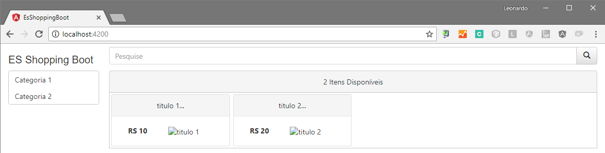

Iremos codificar os componentes, mas ainda sem nos comunicarmos com o backend.

Versão Inicial


Versão Final


app.module.ts
```javascript
@NgModule({
  declarations: [
    AppComponent,
    ItensComponent,
    MenuComponent,
    MenuLatComponent,
    ThumbnailComponent
  ],
  imports: [
    BrowserModule,
    BrowserAnimationsModule,
    DataGridModule,
    PanelModule,
    MenuModule,
    InputTextModule
  ],
  providers: [ShoppingService],
  bootstrap: [AppComponent],
  schemas: [NO_ERRORS_SCHEMA, CUSTOM_ELEMENTS_SCHEMA]
})
export class AppModule { }
```

app.component.html
```html
<div class="ui-g">
  <div class="col-md-2">
    <h3 style="font-size: 20px">ES Shopping Boot</h3>
  </div>
  <div class="col-md-10">
    <app-menu></app-menu>
  </div>
  <div class="col-md-2">
    <app-menu-lat [itens]="categorias"></app-menu-lat>
  </div>
  <div class="col-md-10">
    <app-itens [itens]="itens"></app-itens>
  </div>
</div>
```

app.component.ts
```javascript
@Component({
  selector: 'app-root',
  templateUrl: './app.component.html',
  styleUrls: ['./app.component.css']
})
export class AppComponent implements OnInit {
  itens: any[] = [];
  categorias: any[] = [];

  constructor(private service: ShoppingService) {}

  ngOnInit(): void {
    this.itens = this.service.getItens();
    this.categorias = this.service.getCategorias();
  }
}
```

thumbnail.component.html
```html
<p-panel [style]="{'text-align': 'center'}">
  <p-header [title]="titulo">{{titulo.substring(0, 20)}}...</p-header>
  <div>
    <span class="preco">RS {{preco|number}}</span>
    
  </div>
</p-panel>
```

thumbnail.component.ts
```javascript
@Component({
  selector: 'app-thumbnail',
  templateUrl: './thumbnail.component.html',
  styleUrls: ['./thumbnail.component.css']
})
export class ThumbnailComponent {
  @Input() titulo: string;
  @Input() preco: number;
  @Input() src: string;
  @Input() descricao: number;

  constructor() { }
}
```

menu.component.html
```html
<div class="input-group" style="padding-top: 6px;">
  <input pInputText [(ngModel)]="query" type="text" class="form-control" placeholder="Pesquise" size="100">
  <div class="input-group-btn">
    <button class="btn btn-default" (click)="buscar()">
      <i class="glyphicon glyphicon-search"></i>
    </button>
  </div>
</div>
```

menu.component.ts
```javascript
@Component({
  selector: 'app-menu',
  templateUrl: './menu.component.html',
  styleUrls: ['./menu.component.css']
})
export class MenuComponent {
  query: string;

  constructor() { }

  buscar() { }
}
```

menu-lat.component.html
```html
<p-menu [model]="itens"></p-menu>
```
menu-lat.component.ts
```javascript
@Component({
  selector: 'app-menu-lat',
  templateUrl: './menu-lat.component.html',
  styleUrls: ['./menu-lat.component.css']
})
export class MenuLatComponent {
  @Input() itens: MenuItem[] = [];

  constructor() { }
}
```

itens.component.html
```html
<p-dataGrid [value]="itens">
  <p-header>{{itens.length}} Itens Disponíveis</p-header>
  <ng-template let-item pTemplate="item">
    <div style="padding: 3px" class="ui-md-3">
      <app-thumbnail [preco]="item.preco" [descricao]="item.titulo" [src]="item.thumbnail" [titulo]="item.titulo"></app-thumbnail>
    </div>
  </ng-template>
</p-dataGrid>
```

itens.component.ts
```javascript
@Component({
  selector: 'app-itens',
  templateUrl: './itens.component.html',
  styleUrls: ['./itens.component.css']
})
export class ItensComponent {
  @Input() itens: any[] = [];

  constructor() { }
}
```

shopping.service.ts
```javascript
@Injectable()
export class ShoppingService {

  constructor() { }

  public getItens() {
    return [{
      preco: 10,
      titulo: 'titulo 1',
      thumbnail: ''
    }, {
      preco: 20,
      titulo: 'titulo 2',
      thumbnail: ''
    }];
  }

  public getCategorias() {
    return [{
      label: 'Categoria 1',
      url: '#'
    }, {
      label: 'Categoria 2',
      url: '#'
    }];
  }
}
```
